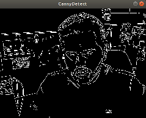
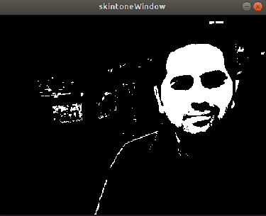

[](https://opensource.org/licenses/MIT)

<p align="center"></p>

# OpenVX Samples

<a href="https://www.khronos.org/openvx/" target="_blank">Khronos OpenVX™</a> is an open, royalty-free standard for cross-platform acceleration of computer vision applications. OpenVX enables performance and power-optimized computer vision processing, especially important in embedded and real-time use cases such as face, body, and gesture tracking, smart video surveillance, advanced driver assistance systems (ADAS), object and scene reconstruction, augmented reality, visual inspection, robotics and more.

In this project, we provide OpenVX sample applications to use with any conformant implementation of OpenVX.

* [VX Bubble Pop Sample](#vx-bubble-pop-sample)
* [VX Canny Edge Detector Sample](#canny-edge-detector-sample)
* [VX Skin Tone Detector Sample](#skin-tone-detector-sample)

 ## VX Bubble Pop Sample

In this sample we will create an OpenVX graph to run VX Bubble Pop on a live camera. This sample application uses <a href="https://en.wikipedia.org/wiki/OpenCV" target="_blank">OpenCV</a> to decode input image, draw bubbles/donuts and display the output.

 <p align="center"></p>

### Prerequisites

* [Conformant OpenVX Implementation](https://github.com/KhronosGroup/Khronosdotorg/blob/master/api/openvx/resources.md)

* [OpenCV](https://github.com/opencv/opencv/releases/tag/3.4.0)

* Camera

### Steps to run the Bubble Pop sample

* **Step - 1:** Build and install [Conformant OpenVX Implementation](https://github.com/KhronosGroup/OpenVX-sample-impl). In this example we will use the OpenVX Sample Implementation available on [GitHub](https://github.com/KhronosGroup/OpenVX-sample-impl)

```
Build OpenVX on Linux

* Git Clone project with a recursive flag to get submodules

      git clone --recursive https://github.com/KhronosGroup/OpenVX-sample-impl.git

* Use Build.py script

      cd OpenVX-sample-impl/
      python Build.py --os=Linux --arch=64 --conf=Debug --conf_vision --enh_vision --conf_nn
```

* **Step - 2:** Export OpenVX Directory Path

```
export OPENVX_DIR=$(pwd)/install/Linux/x64/Debug
```

* **Step - 3:** Clone the OpenVX Samples project and build the bubble pop application

```
cd ~/ && mkdir OpenVXSample-pop
cd OpenVXSample-pop/
git clone https://github.com/kiritigowda/openvx-samples.git
```

* **Step - 4:** CMake and Build the pop application

```
mkdir pop-build && cd pop-build
cmake -DOPENVX_INCLUDES=$OPENVX_DIR/include -DOPENVX_LIBRARIES=$OPENVX_DIR/bin/libopenvx.so ../openvx-samples/bubble-pop/
make
```

* **Step - 5:** Run VX Pop application

    * **Bubbles**
    
    ```
    ./vxPop --bubble
    ```
    
    * **Donuts**
    
    ````
    ./vxPop --donut
    ````

## Canny Edge Detector Sample

In this sample we will create an OpenVX graph to run canny edge detection on an image or a live camera. This sample application uses <a href="https://en.wikipedia.org/wiki/OpenCV" target="_blank">OpenCV</a> to decode input image and display the output. 

 <p align="center"></p>

### Prerequisites

* [Conformant OpenVX Implementation](https://github.com/KhronosGroup/Khronosdotorg/blob/master/api/openvx/resources.md)

* [OpenCV](https://github.com/opencv/opencv/releases/tag/3.4.0)

### Steps to run the canny sample

* **Step - 1:** Build and install [Conformant OpenVX Implementation](https://github.com/KhronosGroup/OpenVX-sample-impl). In this example we will use the OpenVX Sample Implementation available on [GitHub](https://github.com/KhronosGroup/OpenVX-sample-impl)

```
Build OpenVX on Linux

* Git Clone project with a recursive flag to get submodules

      git clone --recursive https://github.com/KhronosGroup/OpenVX-sample-impl.git

* Use Build.py script

      cd OpenVX-sample-impl/
      python Build.py --os=Linux --arch=64 --conf=Debug --conf_vision --enh_vision --conf_nn
```

* **Step - 2:** Export OpenVX Directory Path

```
export OPENVX_DIR=$(pwd)/install/Linux/x64/Debug
```

* **Step - 3:** Clone the OpenVX Samples project and build the canny application

```
cd ~/ && mkdir OpenVXSample-canny
cd OpenVXSample-canny/
git clone https://github.com/kiritigowda/openvx-samples.git
```

* **Step - 4:** CMake and Build the canny application

```
mkdir canny-build && cd canny-build
cmake -DOPENVX_INCLUDES=$OPENVX_DIR/include -DOPENVX_LIBRARIES=$OPENVX_DIR/bin/libopenvx.so ../openvx-samples/canny-edge-detector/
make
```

* **Step - 5:** Run Canny application

    * **Live**
    
    ```
    ./cannyEdgeDetector --live
    ```

    * **Image**
    
    ````
    ./cannyEdgeDetector --image ../openvx-samples/images/face.png
    ````
 <p align="center"></p>
 
 ## Skin Tone Detector Sample

In this sample we will create an OpenVX graph to run skintone detection on an image or a live camera. This sample application uses <a href="https://en.wikipedia.org/wiki/OpenCV" target="_blank">OpenCV</a> to decode input image and display the output.

 <p align="center"></p>

### Prerequisites

* [Conformant OpenVX Implementation](https://github.com/KhronosGroup/Khronosdotorg/blob/master/api/openvx/resources.md)

* [OpenCV](https://github.com/opencv/opencv/releases/tag/3.4.0)

### Steps to run the skin tone sample

* **Step - 1:** Build and install [Conformant OpenVX Implementation](https://github.com/KhronosGroup/OpenVX-sample-impl). In this example we will use the OpenVX Sample Implementation available on [GitHub](https://github.com/KhronosGroup/OpenVX-sample-impl)

```
Build OpenVX on Linux

* Git Clone project with a recursive flag to get submodules

      git clone --recursive https://github.com/KhronosGroup/OpenVX-sample-impl.git

* Use Build.py script

      cd OpenVX-sample-impl/
      python Build.py --os=Linux --arch=64 --conf=Debug --conf_vision --enh_vision --conf_nn
```

* **Step - 2:** Export OpenVX Directory Path

```
export OPENVX_DIR=$(pwd)/install/Linux/x64/Debug
```

* **Step - 3:** Clone the OpenVX Samples project and build the Skin Tone application

```
cd ~/ && mkdir OpenVXSample-skintone
cd OpenVXSample-skintone/
git clone https://github.com/kiritigowda/openvx-samples.git
```

* **Step - 4:** CMake and Build the Skin Tone application

```
mkdir skintone-build && cd skintone-build
cmake -DOPENVX_INCLUDES=$OPENVX_DIR/include -DOPENVX_LIBRARIES=$OPENVX_DIR/bin/libopenvx.so ../openvx-samples/skin-tone-detector/
make
```

* **Step - 5:** Run Skin Tone Detector application

    * **Live**
    
    ```
    ./skinToneDetector --live
    ```
    
    * **Image**
    
    ````
    ./skinToneDetector --image ../openvx-samples/images/face.png
    ````
## Contribution
The samples VX Bubble Pop, VX Canny Edge Detector, & VX Skin Tone Detector are contributed by [AMD](https://www.amd.com/en) from their [MIVisionX Toolkit](https://gpuopen-professionalcompute-libraries.github.io/MIVisionX/). We welcome contributions to this project from all developers. Please open a pull request with details of your sample application to be accepted into this project.
